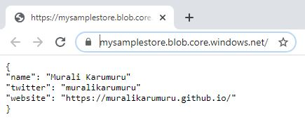

Some scenarios require to use shared access signature (SAS) for accessing storage blob without revealing the storage account key. A few possible scenarios that I would like to mention are:
 - Copying data from blob to azure SQL database
 - Deploying linked ARM templates
 - Grant limited temporary access on storage resources without exposing the storage account key

>Azure storage uses the shared access signature to authorize access to storage services. Shared access signature includes SAS token that defines how the storage resource can be accessed. SAS Uri is a combination of storage resource Uri and SAS token.

I'm going to use service-level SAS which is one of the [three types of shared access signatures](https://docs.microsoft.com/en-us/rest/api/storageservices/delegate-access-with-shared-access-signature#types-of-shared-access-signatures) to access one of the blobs for the purpose of the demonstration. As we are using service-level SAS, I will create SAS token only at the blob level so the delegated access is limited to a specific blob.

:muscle:Let's get into the action. I will be generating the SAS token for the blob that I already have in a `private` blob container using PowerShell in the [azure cloud shell](https://shell.azure.com/)


$resourceGroup = "rg-eus-codecamp"
$storageAccount = "mysamplestore"
$container = "samplecontainer"
$blob = "sampleprofile.json"
$storageAccountKey = (Get-AzStorageAccountKey -ResourceGroupName $resourceGroup -Name $storageAccount).Value[0]
$context = New-AzureStorageContext -StorageAccountName $storageAccount -StorageAccountKey $storageAccountKey
$blobUri = (Get-AzureStorageBlob -blob $blob -Container $container -Context $context).ICloudBlob.uri.AbsoluteUri
$startTime = (Get-Date).AddMinutes(-15)
$endTime = $startTime.AddHours(1.15)
$sasToken = New-AzureStorageBlobSASToken -Container $container -Blob $blob -Permission r -StartTime $startTime -ExpiryTime $endTime -Context $context
Write-Output $sasToken


The PowerShell script returns the SAS token as shown below  
```
?sv=2019-02-02&sr=b&sig=14UxIl42dVXrzqhn9bjLwePybxiP8cSS7Mn8EqHJjo4%3D&st=2020-05-24T17%3A50%3A42Z&se=2020-05-24T18%3A59%3A42Z&sp=r
```

Let's understand the SAS token format that returned from PowerShell. The token string is comprised as described below.

SAS token portion | Description
--- | ---
`sv`| storage version
`st`| signature start time
`se`| signature expiration time
`sr`| signed resource
`sp`| singed permission.
`spr`| permitted protocol (https/http)
`sig`| signature to access the resource

:point_up:Did you notice the first character in the SAS token generated from PowerShell?  
Yes, the first character `?` in the SAS token generated by PowerShell is not actually part of the SAS token. It represent the start of the SAS token string to further construct the SAS Uri. Earlier, we discussed the SAS Uri is a combination of storage resource Uri and SAS token. Let's get the complete SAS Uri for the blob from the below and try to access it from the browser.
```powershell
Write-Output "$blobUri$sasToken"
```

{: .mx-auto.d-block :}

:clap:We have now successfully accessed the blob using service shared access signature Uri.

Consider the potential risks of using SAS and understand if SAS is right option for your requirement. Service level adhoc SAS can be used for granting limited access for a short period. For example, an automation script need to access linked arm template that is stored in a blob container for the deployment.

It is essential to have revoke plan if SAS is planned to share with other users/applications. Consider implementing stored access policy first and then generate SAS token by [applying the stored access policy](https://muralikarumuru.github.io/2020-05-27-stored-access-policy/) as SAS tokens cannot be revoked without changing the storage account key which may not be a viable option. You may also want to refer [best practices when using SAS](https://docs.microsoft.com/en-us/azure/storage/common/storage-sas-overview?toc=/azure/storage/blobs/toc.json#best-practices-when-using-sas)

Happy learning! :smiley:
