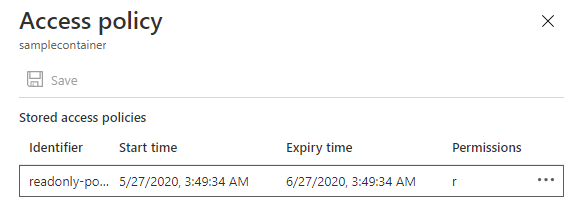
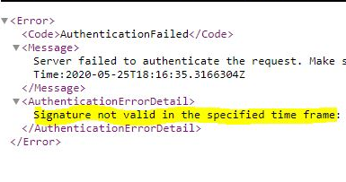

Earlier this week, I posted about [generating service-level shared access signature token](https://muralikarumuru.github.io/2020-05-24-sas-token/) for azure blob storage service. As you may have noticed, the shared access signature (SAS) token was generated by specifying the permission type we want on the resource, signature validity start time and expire time. The SAS token that is generated with this approach is valid as long as the storage account key does not change while the SAS token is still has validity period.

This approach may be suitable for short lived operations like an automation script that need SAS at runtime to access blob. An example that comes to my mind is an automation script that need access to a linked ARM template from a storage container for the deployment.

It may not be a good idea to share SAS with other user/application who want access on storage service for a longer period because the service-level SAS cannot be voided once it is generated without changing the storage account key.

So what if changing the storage account key is not an option:question:  
I'm glad you asked. Azure storage offers stored access policy that can be defined on container, file share, queue and table storage services. It enables the storage account owner to control shared access signature that are bound to the stored access policy.

Let's create a stored access policy on a storage container then generate SAS using the policy we created. I will be using powershell in [azure cloud shell](https://shell.azure.com/). Just so you know, I have placed a sample file named as `sampleprofile.json` in my cloud shell so the below powershell script can upload that sample file to the storage container which is later used to access the file using SAS Uri.


$resourceGroup = "rg-eus-sas"
$location = "eastus"
$storageAccount = "mysaspolicystore"
$container = "samplecontainer"
$blob = "sampleprofile.json"
$policyName = "readonly-policy"
$policyStartTime = (Get-Date).AddMinutes(-15)
$policyEndTime = $policyStartTime.AddMonths(1)
New-AzureRmResourceGroup -Name $resourceGroup -Location $location
$context = (New-AzureRmStorageAccount -ResourceGroupName $resourceGroup -AccountName $storageAccount -Location $location -SkuName Standard_LRS).Context
New-AzureStorageContainer -Name $container -Permission Off -Context $context

# upload a sample file
Set-AzureStorageBlobContent -Container $container -File ".\$blob" -Blob $blob -Context $context
$blobUri = (Get-AzureStorageBlob -blob $blob -Container $container -Context $context).ICloudBlob.uri.AbsoluteUri

# create stored access policy for the container
New-AzureStorageContainerStoredAccessPolicy -Container $container `
 -Policy $policyName `
 -Permission "r" `
 -StartTime $policyStartTime `
 -ExpiryTime $policyEndTime `
 -Context $context

# create SAS token by using the stored access policy
$sasToken = New-AzureStorageContainerSASToken `
   -Name $container `
   -Policy $policyName `
   -Protocol "HttpsOnly" `
   -Context $context

Write-Output "$blobUri$sasToken"


Well, we have created a stored access policy by specifying the permission, policy start time and expiry time. This policy will be saved in azure storage account which you may verify by logging into the azure portal as shown in below.   
{: .mx-auto.d-block :}

Let's quickly grab the SAS Uri from the powershell script output and try to access it from the browser. I want you to keep this SAS Uri copied as we need it one more time as we move forward :smiley:

Great!:+1: We have successfully downloaded the `sampleprofile.json` file

The stored access policy created in this example has one month validity. Imagine the shard access signature that I have given to another user/application is compromised. The shared access signature token can be easily revoked as it is bound to the stored access policy.

Let's see how that works. Update the policy to expire it immediately by setting the it's expire time to a past timestamp and then try to access the SAS Uri again from the browser.


# Lets set shared access policy to expire it immediately
$expireTime = (Get-Date).AddHours(-1)
Set-AzureStorageContainerStoredAccessPolicy `
 -Container $container `
 -Policy $policyName `
 -ExpiryTime $expireTime `
 -Context $context


Now, I am no longer able to access my `sampleprofile.json` file using the SAS token that was generated using the stored access policy which is no longer valid.  
{: .mx-auto.d-block :}

In summary, service level shared access signatures can be used for short lived operations. Prepare a revoke plan if shared access signature is planned to share with other user/application. Consider the potential risks of using SAS and understand if it is right option for your requirement.

Stay safe! Keep learning! :smiley:
