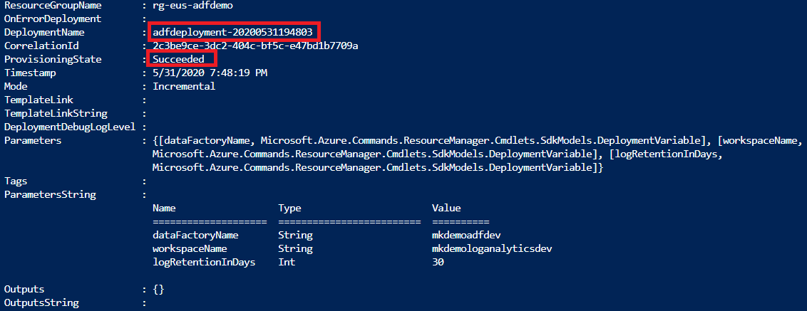
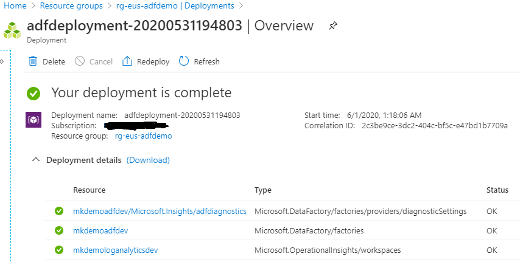
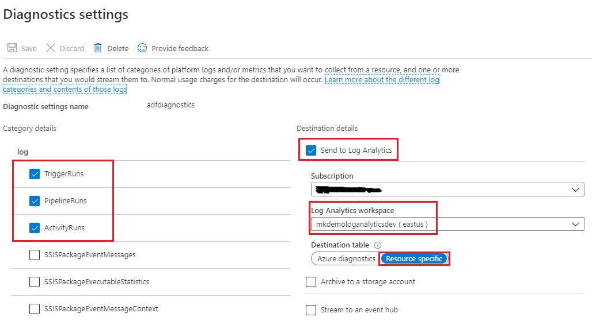
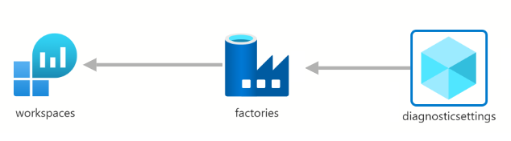

As you may know, azure data factory out of the box monitoring allows to view logs and metrics for 45 days only. It may not be sufficient for some environments where data factory logs needs to be analyzed beyond the default retention days. The out of the box monitoring also does not allow to write custom log search queries on pipeline-runs, activity-runs. However azure monitor offers log analytics service to store resource specific logs and also enables to write custom log analytics queries using KQL.

I'll discuss about enabling data factory diagnostic settings for routing the data factory logs to azure log analytics service which enables rich analysis experience and customized operations reporting.

{: .box-note}
:bulb: Azure data factory logs can also be routed to storage account and event hub.

Let's get started. I have created the ARM template and powershell script for provisioning data factory resource along with enabling diagnostic settings for collecting data factory logs.

Let's clone [my azdatafactory repository](https://github.com/muralikarumuru/azdatafactory) and run the powershell script for deploying the ARM template in the [cloud shell](https://shell.azure.com/).


git clone https://github.com/muralikarumuru/azdatafactory.git
./azdatafactory/adf-configure-diagnostics/armDataFactoryDeploy.ps1


The deployment has been succeeded as you can see below status:point_down:  

Let's also check the `rg-eus-adfdemo` resource group deployment details from the azure portal. As you can see the deployment has created three resources which I will briefly explain shortly at the end.  

Finally, let's check the data factory diagnostic settings from the azure portal. We have successfully enabled the log analytics for azure data factory as we can see below   

The ARM template is composed with three resources. The template first creates a log analytics workspace resource then it creates the data factory and finally it creates the diagnostic setting resource for the created data factory. The below is a visual representation of the arm template.  
  

Thank you for reading! Stay safe!
