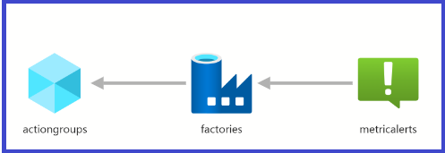
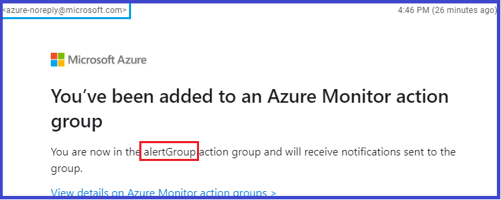
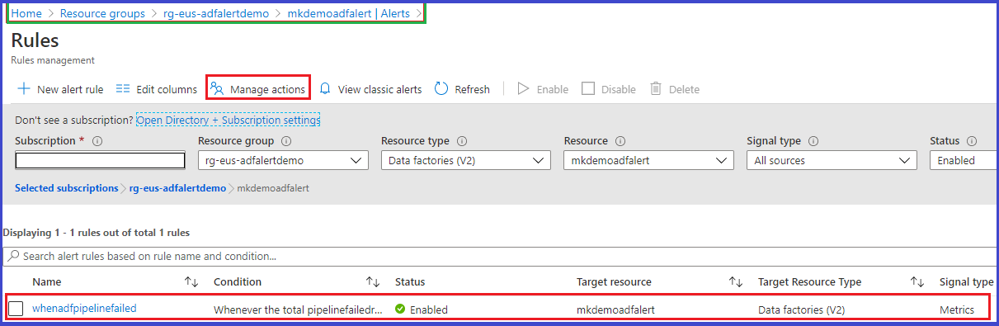
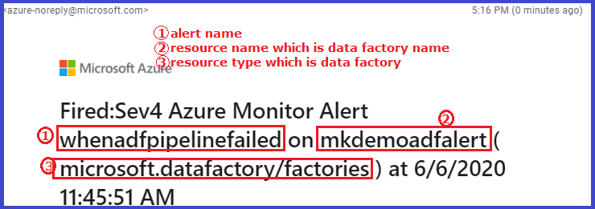

In my previous post, I have shown [configuring diagnostic settings for azure data factory](https://muralikarumuru.github.io/2020-06-01-adf-log-settings/) using azure resource manager(arm) template. Let's look at enabling alert rule for `PipelineFailedRuns` data factory metric in this post. `PipelineFailedRuns` metric provides the total count of failed data factory pipelines within a minute window. My goal for this post is to show you how to receive an email notification as soon as a data factory pipeline is failed by enabling alert rule for `PipelineFailedRuns` metric with azure resource manager template.

>Did you know? azure data factory emits [six types of metrics](https://docs.microsoft.com/en-us/azure/data-factory/monitor-using-azure-monitor#metrics)

Lets' get started. I have already created arm template that comprises of `actionGroups`, `data factory` and `metricAlerts` resources. Below is a visual representation of the arm template.  


_**actionGroups**_: This resource type defines action preferences that needs to be performed for an alert rule. The action types include sending a voice call, SMS, email and various other automated actions like integrating with azure logic app etc. I have referred to [microsoft.insights actionGroups template reference](https://docs.microsoft.com/en-us/azure/templates/microsoft.insights/2018-03-01/actiongroups) for authoring the arm template for `actionGroups` resource.  
_**factories**_: I have used [Microsoft.DataFactory factories template reference](https://docs.microsoft.com/en-us/azure/templates/microsoft.datafactory/2018-06-01/factories) for provisioning data factory resource.  
_**metricAlerts**_: This resource defines the alert rule specification for target resource which is azure data factory in this example. I have referred to [Microsoft.Insights metricAlerts template reference](https://docs.microsoft.com/en-us/azure/templates/microsoft.insights/2018-03-01/metricalerts) for authoring `metricAlerts` resource.

Let's deploy the arm template using powershell from [azure cloud shell](https://shell.azure.com/).  
```
git clone https://github.com/muralikarumuru/azdatafactory.git
```  
Don't forget to edit the arm template parameter file to update the email address as I have provided a dummy email address in my [azdatafactory](https://github.com/muralikarumuru/azdatafactory) repository :smiley:  

Let's run the powershell script that creates a resource group and deploys the arm template.
```
./azdatafactory/adf-configure-alerts/armDataFactoryDeploy.ps1
```  
You will receive an email from `azure-noreply@microsoft.com` confirming that you have been added to action group as soon as the arm template deployment is completed successfully.  


Let's quickly check alert rule configuration from azure portal. As you can see below :point_down: action group, data factory and alert rule have been successfully created :thumbsup:


{: .box-note}  
:bulb: Try correlating the action group settings and alert rule settings from the azure portal with the arm template for better understanding of action group resource properties and metric alert resource properties defined in the arm template.  

Finally, I would encourage you to create a data factory pipeline and make it to fail so you can test whether you are receiving email notifications as expected for the failed data factory pipelines. Below is a sample email notification for the failed data factory pipeline.  


To summarize the post, azure monitor enables unified alerting experience for azure resources performance metrics. We can configure alerts for azure data factory by using [action groups](https://docs.microsoft.com/en-us/azure/azure-monitor/platform/action-groups?ocid=AID754288&wt.mc_id=CFID0448) and [metric alerts](https://docs.microsoft.com/en-us/azure/azure-monitor/platform/alerts-metric-overview) to proactively notify when a specific metric cross the defined threshold.

That's all folks! Stay safe!
