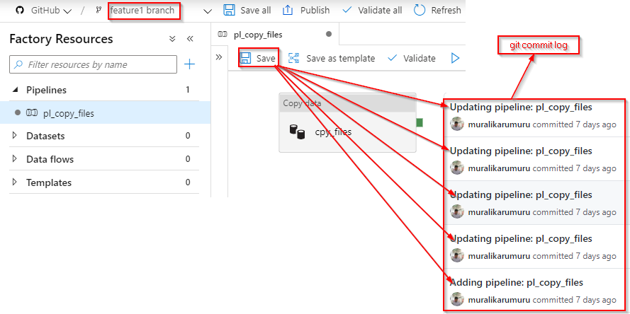
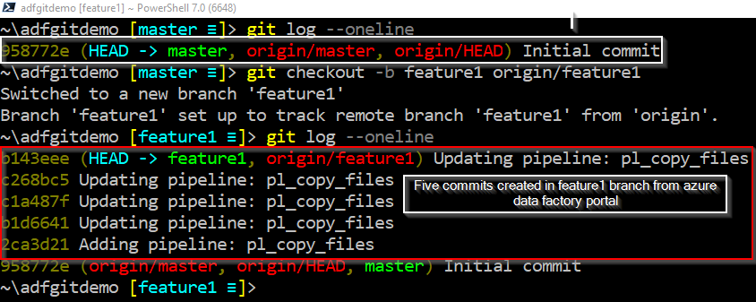
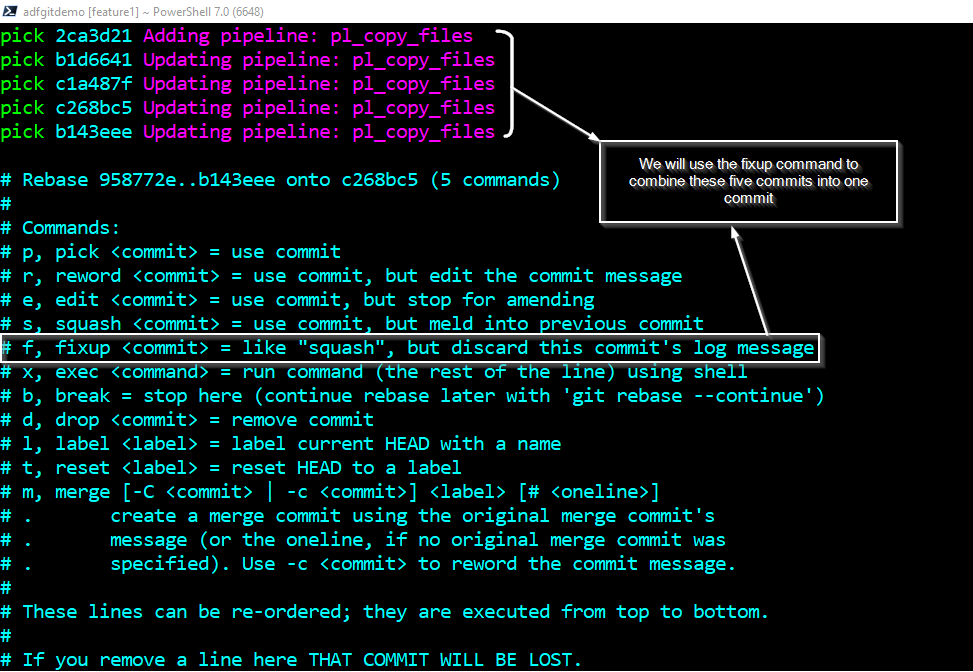
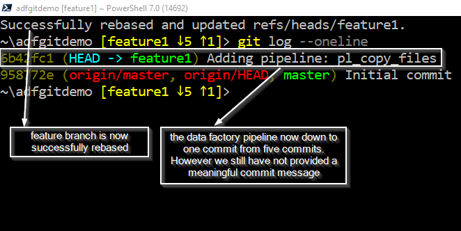
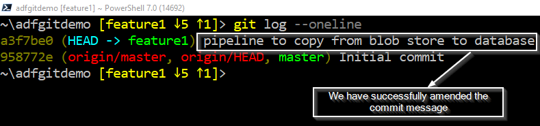
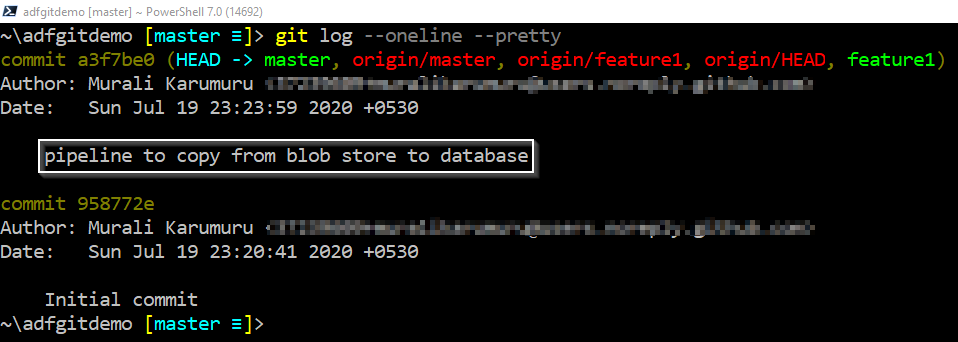

You hit the save button while authoring data factory pipeline from the azure data factory portal which is integrated with git will automatically writes a commit to the git feature branch you are working on. You may be frequently hitting the save button to save your modified work and the data factory pipeline might end up with too many commits depending on how often you are saving the edited pipeline from the data factory portal. All of these commits will be carried into master (main) branch when the feature branch is merged into master. The data factory pipeline in the example shown below are the commits that were automatically created by the data factory portal.  
  

It would be difficult to examine the history of commits for understanding the changes that occurred overtime to the pipeline when you are specifically looking for a commit that introduced a particular fix or change.
A clean commit history for the data factory pipeline would quickly allow you to find the commits that introduced a particular change.

We can combine all of the commits that were automatically created while working on the feature into a single commit with a meaningful commit message just before merging the pull request so the commit history is kept minimum with appropriate commit messages. So, how do you combine them? Well, the answer is `git rebase` command.

Let me show you the git interactive rebase command to combine multiple commits into a single commit and then edit the commit message with a relevant message.

I'm cloning a sample repository for which the data factory is already integrated with a github repository into my local computer.

git clone --remote https://github.com/muralikarumuru/adfgitdemo.git
cd .\adfgitdemo\


As you can see the feature branch commit log shown below has five commits that were automatically created by the data factory pipeline when I modified the pipeline for five times from the data factory portal.  

I want to rebase the latest five commits that were created by the data factory portal in the feature branch by using `git rebase -i HEAD~5`.

git checkout feature1
git rebase -i HEAD~5


An interactive text editor is presented to edit the commits as shown below  

The commits are shown in the ascending order as they were created. Let's combine the last four commits into the first commit by changing the `pick` command to  `fixup` command in the text editor.
_Note_: You will need to hit escape and then press "I" on your keyboard for modifying the commits in the editor.  
  

_Note_: Hit escape key then press "w" and "q" keys to save and exit from the git interactive rebase editor.

Check the commits in the feature branch after the rebase is successful.  

Lets edit the commit message to more appropriate meaningful message.

git commit --amend
  

Now let's push the feature branch changes to the remote feature branch. Note, the local feature branch is now behind than the remote feature branch.

git push --force


Finally, complete the pull request to merge the feature branch into master branch. Let's have a look at the commit history of the master branch after completing the pull request. The master branch now has a clean commit history for the data factory pipeline by combining all the automatically created commits by the data factory portal.

There are caveats and risks/dangers of using git rebase command. Do not use rebase on a branch that is shared by others. Do not rewrite existing commit history in the feature branch. Use git rebase when you really know what you are doing!

To summarize, git rebase may be used in your feature branch to combine the latest commits created by azure data factory portal while authoring the pipeline. It allows to keep the commit history clean for easily examining the commit history for identifying changes introduced into your data factory pipelines.
