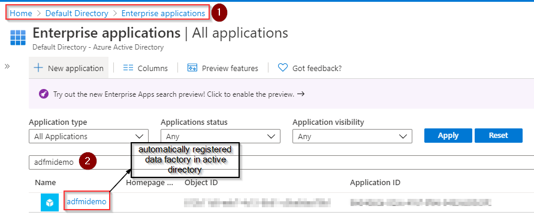
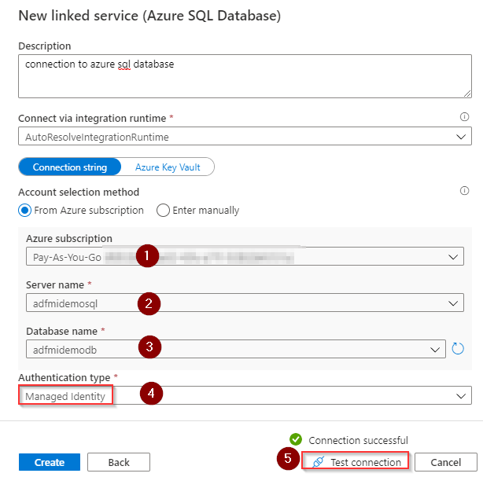

Securing credentials for the azure resources is one the most common challenges. Moving away from passwords is the preferred way of securing azure resources. Authenticating azure resources with credentials can be eliminated by using managed identities.

In this article, I would like to show you implementing a password-less authentication to azure sql database from azure data factory using the managed identity.

An identity for azure data factory is automatically created in azure active directory when the data factory resource is provisioned via azure portal or powershell. if you are provisioning data factory via azure resource manager template (ARM) then you must add identity type in the ARM template as shown below.  `"identity": {
        "type": "SystemAssigned"
    }`

The registered data factory identity details can be found under enterprise applications in the azure active directory menu as shown below.  

Now let's grab the name of the data factory and create a contained database user in the azure sql database. To create azure active directory (AD) based contained database user, you must connect to your azure sql database with AD login that has permission to create a database user. The AD login should have at least ALTER ANY USER permission.

Run the following T-SQL by using SQL Server management studio.  

CREATE USER [data factory name] FROM EXTERNAL PROVIDER;
ALTER ROLE [database role name] ADD MEMBER [data factory name];


Create a linked service for your azure sql database as shown below to verify the data factory can connect to azure sql database using managed identity authentication as we have now added the data factory identity to the azure sql database.  

We have successfully connected to azure sql database from azure data factory using managed identity.

I hope this article helped you to understand how to create a password-less connection to azure sql database from the data factory. The data factory identity can also be used to connect other azure resources that supports active directory authentication.