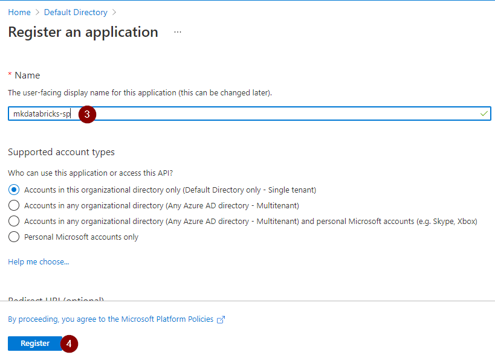

Azure databricks workspace users can securely and easily access azure data lake storage (ADLS) by creating a mount point in azure databricks. This article walks through the steps for creating a mount point using service principal and azure key vault-backed secret scope.

**Requirements**
1. Permissions to register an application with azure active directory
2. Azure key vault
3. Azure data lake store Gen2 with hierarchical name space enabled
4. Azure databricks (standard plan or premium plan)

**Step 1: Register application with azure active directory** 

**Imp note:** Don't forget to copy and save the client secret value which we will be adding to the azure key vault

**Step 2: Copy and save client ID and tenant ID** 

**Step 3: Save secrets to azure key vault** 
3.1 Add the client ID copied in the step# 2 to the azure key vault
3.2 Add the tenant ID copied in the step# 2 to the azure key vault
3.3 Add the client secret created in the step# 1 to the azure key vault 

3.4 Verify the list of secrets added to the key vault before proceeding to the next step 

**Step 4: Copy and save azure key vault URI and resource ID** 

**Step 5: Create key vault-backed secret scope in azure databricks UI** 
5.1 open azure databricks service from azure portal and copy the databricks service url 

5.2 append /#secrets/createScope to the azure databricks workspace url in a new browser window to create a secret scope 

- enter a scope name
- select All users from the Manage Principal drop down if your azure databricks workspace is standard tier.
- enter the azure key vault URI copied in step# 4 in the DNS Name
- ener the azure key vault resource ID copied in step# 4 in the Resource ID
- click create

**Step 6: Assign azure role to the azure AD application** 
Assign the **Storage Blob Data Contributor** role to the azure AD application created in step#1. Refer to [Role-based access control (Azure RBAC)](https://docs.microsoft.com/en-us/azure/storage/blobs/data-lake-storage-access-control-model#role-based-access-control-azure-rbac) to learn more about the azure built-in roles to access storage resources. 

**Step 7: Mount azure data lake storage in azure databricks**  
if you have completed all the previous steps successfully then get ready to complete the final step to create a mount point to access azure data lake storage from the azure databricks.
- Create a container named as sample-datasets in azure data lake storage account
- Create a python notebook in azure databricks and copy the below code to create a mount point
- Replace the scope name with scope name created in step# 6
- Replace the key name with key name created in step# 3


sp_clientid = dbutils.secrets.get(scope="kvsecretscope",key="mkdatabricks-sp-clientid")
sp_clientsecret_value = dbutils.secrets.get(scope="kvsecretscope",key="mkdatabricks-sp-clientsecret")
tenantid = dbutils.secrets.get(scope="kvsecretscope",key="tenantid")

oauth_endpoint = "https://login.microsoftonline.com/"+tenantid+"/oauth2/token"
adls_container_name = "sample-datasets"
adls_account_name = "mkdbstorage"
adls_source = "abfss://{}@{}.dfs.core.windows.net/".format(adls_container_name,adls_account_name)
mount_point_name = "/mnt/sample-datasets"

configs = {"fs.azure.account.auth.type": "OAuth",
          "fs.azure.account.oauth.provider.type": "org.apache.hadoop.fs.azurebfs.oauth2.ClientCredsTokenProvider",
          "fs.azure.account.oauth2.client.id": sp_clientid,
          "fs.azure.account.oauth2.client.secret": sp_clientsecret_value,
          "fs.azure.account.oauth2.client.endpoint": oauth_endpoint}

if not any(mount.mountPoint == mount_point_name for mount in dbutils.fs.mounts()):
    dbutils.fs.mount(source = adls_source,mount_point = mount_point_name,extra_configs = configs)


Let's write sample data to adls using the mount point. 

Let's read data from adls using the mount point. 

Congratulations!!! you have successfully created mount point to securely and easily access data from azure data lake storage.