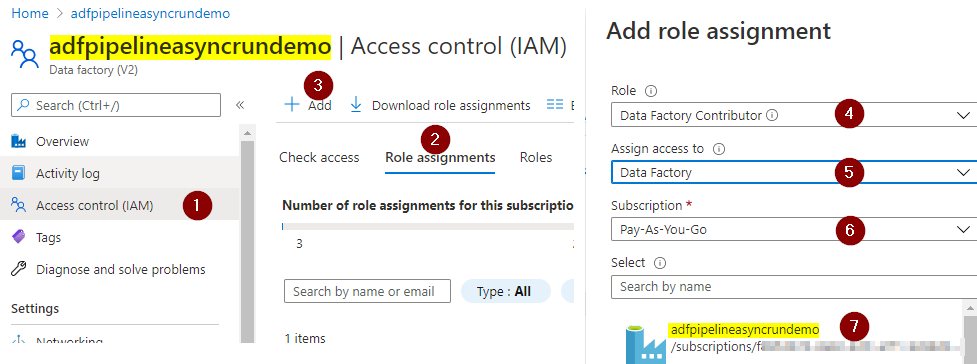

In this post, I would like to explore an option for asynchronously executing a data factory pipeline from another pipeline.  
**Scenario**: Execute data factory pipeline asynchronously (fire and forget) from another pipeline where both calling pipeline and called pipeline are in the same data factory.

Let's set the context before we dive in. We have two data factory pipelines doing some data processing work (it does not matter what they do for the purpose of this post). The calling pipeline namely pipeline_X shall run the another pipeline namely pipeline_Y but does not wait for the pipeline_Y completion.

We are going to use data factory [web activity](https://docs.microsoft.com/en-us/azure/data-factory/control-flow-web-activity) and data factory [CreateRun](https://docs.microsoft.com/en-us/rest/api/datafactory/pipelines/create-run) REST endpoint to implement the above scenario.

Let's dive into the action. Create two pipelines namely pipline_X and pipeline_Y. Pipeline_X contains a web activity and pipeline_Y contains a wait activity for the purpose of the demonstration.  
The following screenshots walk you through steps for creating two pipelines to demonstrate the asynchronous execution of pipeline_Y from pipeline_X.  

**Step 1**: Assign data factory contributor role to the same data factory. Yes, this step is required even though both pipeline are in the same data factory. Open your data factory Access control blade and assign the data factory contributor role as shown below.  

**Step 2** Create pipelines. First, create the pipeline_Y as we need to call this pipeline in the master pipeline  
**pipeline_Y**:  

**pipeline_X**:  
  
  

The URL in the above settings is the REST endpoint for [CrereRun](https://docs.microsoft.com/en-us/rest/api/datafactory/pipelines/create-run) API. Replace {pipelinename} with pipeline_Y and other values appropriately.

**Step 3**: Run the master pipeline i.e pipeline_X  
**Step 4**: Monitor both pipelines completion status  
  
  
As you can see the completion time for both pipelines, the master pipeline pipeline_X asynchronously executed pipeline_Y and immediately completed without waiting for the pipeline_Y completion.

I hope you found this post useful for invoking a pipeline from another pipeline for fire and forget scenario and working data factory REST endpoints. Thanks for reading.

